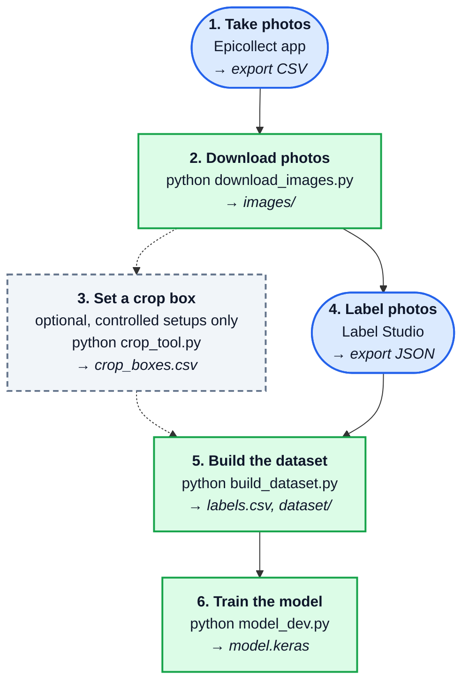

# Liquid Level CV

A computer vision model for Husky Robotics that estimates how full a container is from a photo.

## Goal

The purpose of this project is to accurately add a specific volume of liquid to a container. Combining the model's predicted fill level with the container's known volume gives the volume of liquid already inside, which tells us how much more to add.

Given a photo of a container (such as a beaker) holding liquid, the model finds three heights in the image:

- **top**: the top rim of the container
- **bottom**: the outside of the container's glass base
- **liquid**: the bottom of the curved liquid surface (meniscus)

From those three heights, the fill percentage is:

```
fill % = (bottom - liquid) / (bottom - top) * 100
```

This is the fraction of the container's **height** that is filled. It equals the fraction of its **volume** only for straight-sided containers.

The model is a small convolutional neural network (CNN) built with TensorFlow/Keras. It takes a 128×128 preprocessed photo and outputs the three heights.

### How the pieces fit together



**Blue, rounded:** done by a person · **Green:** a script you run · **Dashed:** optional · **→** what the step produces. The numbers match the steps in the [training walkthrough](#training-walkthrough).

## Project files

### Scripts

| File | What it does |
|---|---|
| `download_images.py` | Reads an Epicollect CSV export and downloads each photo into `images/`, named `<ec5_uuid>_<session>.jpg`. Photos that were already downloaded are skipped, so it's safe to rerun after each new export. Downloads go to a temporary `.part` file first, so a failed download never looks like a finished photo. |
| `crop_tool.py` | For **controlled setups** where the camera and container don't move. Opens a reference photo so you can drag a box around the container, saves cropped previews of every photo in that session to `cropPreview/<session>/` for checking, and then saves the box to `crop_boxes.csv`. Needs a screen, so it's kept separate from the pipeline. |
| `read_labels.py` | Converts a Label Studio JSON export into `labels.csv`. Label Studio stores points as percentages of the image, and this converts them to pixel heights. Images with a missing or duplicate label, and images skipped in Label Studio, are left out. |
| `preprocessing.py` | Prepares images for the model. For each image in `labels.csv` it:<br>1. Crops to the container, using the session's box from `crop_boxes.csv` if there is one, otherwise OpenCV edge detection. Edge detection currently works best against light backgrounds.<br>2. Resizes and pads to 128×128.<br>3. Converts the label heights to match the cropped and resized image.<br>4. Saves the result to `dataset/`.<br>Labels slightly outside the crop (within `LABEL_TOLERANCE`, 3 pixels) are moved back to the edge; labels further out are skipped. Running `python preprocessing.py` on its own rebuilds `dataset/` from the existing `labels.csv`, which is useful after changing preprocessing or crop boxes. |
| `build_dataset.py` | Runs `read_labels.py` and then `preprocessing.py` in one step, clears out old preprocessed images first, and prints a summary of how many images made it through each stage. |
| `model_dev.py` | Builds and trains the CNN on `dataset/dataset.csv`, then saves the trained model to `model.keras`. Training and validation photos are split **by session**: photos from the same session look nearly identical, so keeping whole sessions together tests whether the model works on setups it hasn't seen. |

### Data and settings

| File / folder | What it holds |
|---|---|
| `requirements.txt` | Python packages used by the scripts. Label Studio isn't listed because it's installed separately (see setup). |
| `images/` | Original photos downloaded from Epicollect. |
| `labels.csv` | Label heights in **original photo** pixels: `filename, y_top, y_bottom, y_meniscus`. This is the record of the labeling work. |
| `crop_boxes.csv` | Saved crop boxes for controlled sessions: `session_id, left, top, right, bottom`, as fractions of the image size. Created the first time `crop_tool.py` saves a box. |
| `dataset/dataset.csv` | What the model trains on: `image_path, session_id, bottom_coordinate, top_coordinate, liquid_coordinate, fill_percentage`. Coordinates are in pixels of the 128×128 preprocessed image. Generated by `build_dataset.py`, so don't edit it by hand. |
| `dataset/pp_*.png` | Preprocessed 128×128 images. Generated, not committed. |
| `cropPreview/`, `testImages/` | Previews from `crop_tool.py` and test output from `preprocessing.TestImages()`. Generated, not committed. |
| `model.keras` | The trained model, created by `model_dev.py`. |

In images, y-coordinates are measured **from the top of the image downward**, so a fuller container has a *smaller* liquid y-value.

## Training walkthrough

Run every command from the project folder. The scripts use paths like `images/` and `dataset/` relative to where they're run.

### 0. One-time setup

**Python environment.** You need Python 3.11 or newer. 3.12 is recommended, since TensorFlow often doesn't support the newest Python yet.

```bash
python3.12 -m venv env
source env/bin/activate          # Windows: env\Scripts\activate
pip install -r requirements.txt
```

Each person makes their own `env/`; it's ignored by git.

**Label Studio.** Install it separately from the project's environment, since it has many dependencies of its own. [pipx](https://pipx.pypa.io) keeps it isolated:

```bash
pipx install label-studio
```

**Label Studio project** (once per person):

1. Start Label Studio as shown in step 4 and create a local account.
2. Create a project. Under **Labeling Setup → Custom template**, paste:
   ```xml
   <View>
     <Image name="img" value="$image" zoom="true" zoomControl="true" crosshair="true"/>
     <KeyPointLabels name="kp" toName="img" strokeWidth="1" opacity="0.9">
       <Label value="top" background="red" hotkey="1"/>
       <Label value="bottom" background="blue" hotkey="2"/>
       <Label value="meniscus" background="green" hotkey="3"/>
     </KeyPointLabels>
   </View>
   ```
   The label names must be exactly `top`, `bottom` and `meniscus`, because `read_labels.py` looks for them.
3. Under **Settings → Cloud Storage → Add Source Storage**, choose **Local files** and enter:
   - **Absolute local path:** the full path to this project's `images/` folder
   - **File filter regex:** `.*\.jpg$` (so unfinished `.part` downloads are never imported)
   - Turn on **Treat every bucket object as a source file**

### 1. Take photos with Epicollect

Submit photos through the Epicollect form. Fill in **SessionID** with the same value for every photo taken in one sitting (same container, place and lighting). Use only letters, numbers and dashes, because the session ID becomes part of the filename.

### 2. Download the photos

Export the entries from Epicollect as CSV, then run:

```bash
python download_images.py
```

Enter the path to the exported CSV when asked.

### 3. (Optional) Set a crop box for a controlled setup

If a session was photographed with a fixed camera and container, set its crop box instead of relying on edge detection:

```bash
python crop_tool.py
```

Enter the path to one photo from the session, drag a box around the container (leave a little room around it), and press Enter. Check the previews in `cropPreview/<session>/` before saving.

### 4. Label the photos in Label Studio

Start Label Studio with local file serving turned on, replacing the path with the full path to this project folder:

```bash
LABEL_STUDIO_LOCAL_FILES_SERVING_ENABLED=true \
LABEL_STUDIO_LOCAL_FILES_DOCUMENT_ROOT=/path/to/liquid-level-cv \
label-studio start
```

Without these two settings, images fail to load with 404 errors.

In the project's **Settings → Cloud Storage**, click **Sync Storage** to bring in newly downloaded photos. Then label each photo following these guidelines, so everyone's labels mean the same thing.

#### Labeling guidelines

Place exactly one point for each label. Photos with a missing or extra point are left out of the dataset.

- **top** (hotkey `1`): the top rim of the container
- **bottom** (hotkey `2`): the outside of the glass base, where the glass ends. Mark the glass itself, not its shadow.
- **meniscus** (hotkey `3`): the bottom of the curved liquid surface. If the container is empty, place it at the bottom, as close as possible to the **bottom** point.

Click all three points along the **middle section** of the container (halfway between its left and right sides), not near the edges or the spout. Zoom in to place points precisely.

When finished, use **Export → JSON** (not JSON-MIN) and save the file.

Don't rename images after labeling them. Label Studio's tasks point at the filenames, so renamed images break the link to their labels.

### 5. Build the dataset

```bash
python build_dataset.py path/to/export.json
```

This creates `labels.csv`, the preprocessed images and `dataset/dataset.csv`, and ends with a summary such as:

```
7 tasks in export -> 5 in labels.csv -> 5 in dataset/dataset.csv
2 image(s) were dropped, see the messages above for why.
```

### 6. Train the model

```bash
python model_dev.py
```

The trained model is saved to `model.keras`. Training needs photos from **at least two sessions**, since whole sessions are held back for validation. The more sessions and setups, the better the model will handle new ones.

## Rules for contributors

- **Adding a Python package:** add it to `requirements.txt` by hand with its version pinned (`package==1.2.3`). Don't run `pip freeze > requirements.txt`; it lists every indirect dependency in your environment and makes the file hard to maintain.
- **Never edit `dataset/dataset.csv` by hand.** If a label is wrong, fix it in Label Studio, export again and rerun `build_dataset.py`. Otherwise the dataset and the labels drift apart.
- **Commit `labels.csv` and `crop_boxes.csv`.** `labels.csv` is the record of everyone's labeling work, and `crop_boxes.csv` holds settings the whole team needs. Generated files (`env/`, preprocessed images, previews) are already excluded by `.gitignore`.
- **Don't rename images after labeling them.** Label Studio and `labels.csv` refer to images by filename.

## Troubleshooting

### Images don't load in Label Studio (404 errors in the terminal)

- Label Studio was started without the two `LABEL_STUDIO_LOCAL_FILES_...` settings, or the document root isn't the project folder. Restart it with the command in step 4.
- The tasks point at images that were renamed or deleted. Delete those tasks in Label Studio, then click **Sync Storage**.

### `KeyError: 'ec5_uuid'` when reading an Epicollect export

Epicollect exports begin with a hidden byte order mark (BOM) that gets attached to the first column name. `download_images.py` already handles this by opening the file with `encoding='utf-8-sig'`. Any new script that reads Epicollect exports needs the same.

### `KeyError: '2_SessionID'` or `'1_Photo_of_Container'`

Epicollect puts each question's position number in front of its column name. If questions on the form are added or reordered, the names change. Check the header row of the new export and update the names in `download_images.py`.

### `Bad label set: ...` from `build_dataset.py`

That photo is missing a label or has two of one. Fix it in Label Studio and export again.

### `Skipping ... Coordinates out of cropped container bounds`

A label is more than 3 pixels outside the cropped image. Usually the automatic crop cut off part of the container, or a point was placed far off. Check the photo's crop by running `python -c "import preprocessing; preprocessing.TestImages()"` and entering the photo's path; the processed image is saved to `testImages/`. Then relabel it or set a crop box with `crop_tool.py`.

### `Clamping ... label slightly outside the crop`

A label was just outside the crop and was moved to the edge. The image is still used, but it's worth checking the label.

### `ValueError: ... the resulting train set will be empty` from `model_dev.py`

There aren't enough sessions to split into training and validation. Add photos from at least one more session.

### `ModuleNotFoundError` or the wrong Python version

The virtual environment isn't active. Run `source env/bin/activate` (Windows: `env\Scripts\activate`) and check `python --version`.

### `label-studio: command not found`

Open a new terminal after installing with pipx, or run `pipx ensurepath` first.

## Current status and limitations

- **The data pipeline works end to end**: downloading, labeling, and building the dataset. So far it has only been run on a handful of labeled photos.
- **The model hasn't been trained on a real dataset yet.** Settings in `model_dev.py` marked as "filler value" are placeholders to tune once there's enough data.
- **Automatic cropping is approximate.** Edge detection works best against light backgrounds and can pick up shadows. Controlled setups should use a crop box from `crop_tool.py`.
- **Some early photos have no session ID.** They're all treated as one session during training.
- **The fill level is measured by height, from the outside of the glass base.** Converting it to a volume will need to account for the container's shape and the thickness of its base.

## Using the model

Coming soon.
